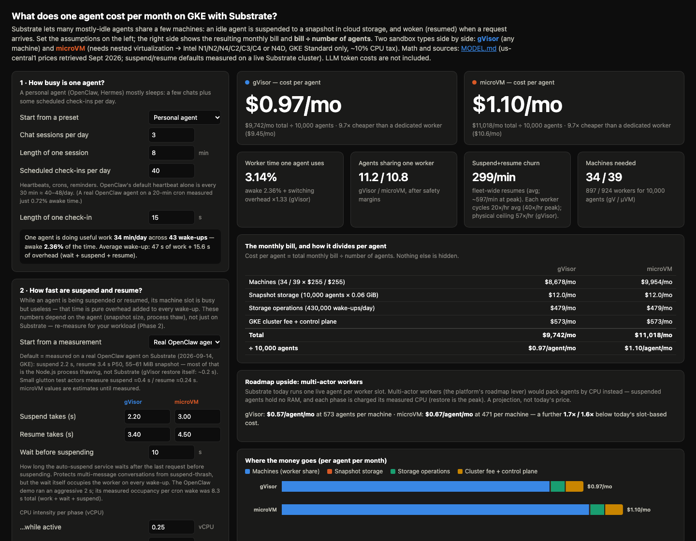
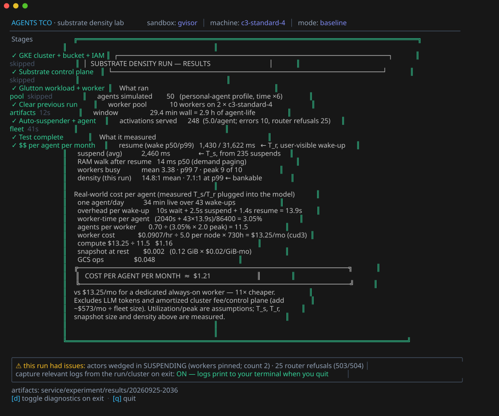

# substrate-agents-tco

Cost of running "personal agents" (OpenClaw / Hermes shaped: mostly idle,
always addressable) on GKE with [Agent Substrate](https://github.com/agent-substrate/substrate),
in two phases:

1. **Theory** — an interactive calculator for $/agent/month under
   suspend/resume multiplexing, for gVisor and microVM sandboxes.
2. **Practice** — a one-command lab (TUI) that builds a cluster, runs a real
   fleet, and measures the density and cost you actually get.

## Phase 1: the calculator

**▶ Use it right now: [aditya-shantanu.github.io/substrate-agents-tco/calculator.html](https://aditya-shantanu.github.io/substrate-agents-tco/calculator.html)**

(or open [`calculator.html`](calculator.html) locally — no build, works from
`file://`). Every assumption is an input with its provenance next to it;
outputs update live. Presets are shareable via URL parameters, e.g.
[`?cycleCap=0.5`](https://aditya-shantanu.github.io/substrate-agents-tco/calculator.html?cycleCap=0.5).



The math, price book (us-central1, retrieved 2026-09-25), and measured
constants all live in [`MODEL.md`](MODEL.md). Core identity (the
benchmarking QPS formula, inverted):

```
occupancy/agent  d' = duty_cycle × (burst + idle_wait + suspend + resume) / burst
agents/worker    N  = utilization ÷ peak-adjusted occupancy
                      (busiest-hour multiplier, or a herd fraction charged at full occupancy)
$/agent/month       = worker_$/hr × 730 / N + snapshot GiB × $/GiB-mo + GCS ops + fixed/fleet
```

What the calculator shows:
- **The whole bill**: each machine's $/month, the fleet-wide monthly bill
  (machines + snapshots + storage ops + cluster fee), and cost per agent =
  bill ÷ agents. Suspend/resume churn rates against each worker's physical
  ceiling, with an optional churn cap.
- **Two peak lenses** (pick one): busiest-hour multiplier for
  timezone-driven fleets, or a **herd %** for cron-aligned fleets — the herd
  is charged full occupancy during its burst.
- **Per-phase CPU weights** (active 0.25 / suspend 0.30 / **restore 1.22
  vCPU** — restore is the most expensive thing an agent does) powering a
  **multi-actor workers projection**: what the same fleet costs when agents
  pack by CPU instead of one-per-worker slots (the platform's roadmap
  lever), memory-bound-checked so it can't overclaim past RAM.
- Suspend/resume defaults are **measured** (live cluster run + a real
  OpenClaw deployment), with a small-test-actor preset for the optimistic
  end. Sources and numbers: [`MODEL.md`](MODEL.md) appendices.

Ballpark with defaults (10k agents, measured switch times, 10s idle wait,
3y CUD, both scenarios on n2-standard-16): **≈$1.0/agent/month gVisor,
≈$1.1 microVM**, versus ~$7–15 for a dedicated worker or VPS; the
multi-actor projection lands well under $1. LLM tokens are out of scope
(and typically dominate).

## Phase 2: measure it

One command runs the whole show — configure, build the cluster, run the real
workload, watch it live, end on the measured $/agent/month:

```bash
cd service && go run ./cmd/tco
```




A full-screen TUI (substrate-gke's visual language): config screen with
prefilled choices — GCP project (auto-detected), a live probe of the
existing cluster and its node pools, **gVisor vs microVM** (the machine
dropdown filters to nested-virt types), fleet/compression/duration/pricing,
peak lens, **baseline or load-test** mode — a calibrated load gauge and
model cost preview, then self-skipping setup stages, a live view
(awake/asleep agents, worker bar + sparkline, suspend/resume latency,
throughput, wedged-worker accounting, load-test wave table), and the cost
card, with an optional diagnostics dump on exit when a run had issues.
Headless equivalent: `service/experiment/run.sh` (`--load-test`,
`--duration`, `--agents`, …).

Under the hood, three Go binaries built against the sibling `substrate`
checkout:

- **tco**: the TUI, driving the numbered scripts in `service/experiment/`.
- **autosuspender**: the missing suspend side of the loop (resume-on-request
  already exists in atenet). Activity-signal API + TTL fallback + occupancy
  sampling + a web dashboard at `/` + a **medic** that heals actors wedged
  by a platform bug we found and filed
  ([agent-substrate/substrate#1914](https://github.com/agent-substrate/substrate/issues/1914)).
- **agentsim**: N simulated personal agents against Glutton actors through
  the router — implicit resume, RAM working-set walk (demand paging), memory
  churn and file I/O every turn, Poisson sessions/wakes, time compression,
  and a wave-based load-test mode that finds the pool's ceiling.

Full instructions, knobs, "what you'll see" and gotchas:
[`service/README.md`](service/README.md).

## Measured result

First live run (2026-09-25, GKE, 50 agents on 10 workers / 2× c3-standard-4):
**$1.21/agent/month measured** — suspend 2.46s avg, resume 1.43s p50,
0.116 GiB snapshots, density 14.8:1 mean / 7.1:1 at p99 — matching the
calculator's prediction for the same config exactly. Artifacts:
[`assets/runs/2026-09-25-baseline-x6/`](assets/runs/2026-09-25-baseline-x6/report.txt).
Biggest surprise the harness caught: a resume-during-suspend race that
wedges actors in SUSPENDING and pins their workers — root-caused and filed
upstream as [agent-substrate/substrate#1914](https://github.com/agent-substrate/substrate/issues/1914).

## Repo map

```
calculator.html              interactive cost calculator (Phase 1)
MODEL.md                     the math + price book + measured constants
service/cmd/tco              the TUI: configure → stages → live test → $$/agent card
service/cmd/autosuspender    suspend side of the loop + web dashboard + medic
service/cmd/agentsim         personal-agent workload simulator (+ load-test waves)
service/experiment/          numbered scripts the TUI drives (also usable by hand)
service/analysis/            report.py (density deep-dive) · final_report.py ($$ card)
service/manifests/           k8s manifests for the experiment namespace
assets/screenshots/          README screenshots (utils/screenshots.sh regenerates)
assets/runs/                 archived artifacts of measured runs
utils/screenshots.sh         regenerate all screenshots (TUI via freeze, calculator via Chrome)
```
