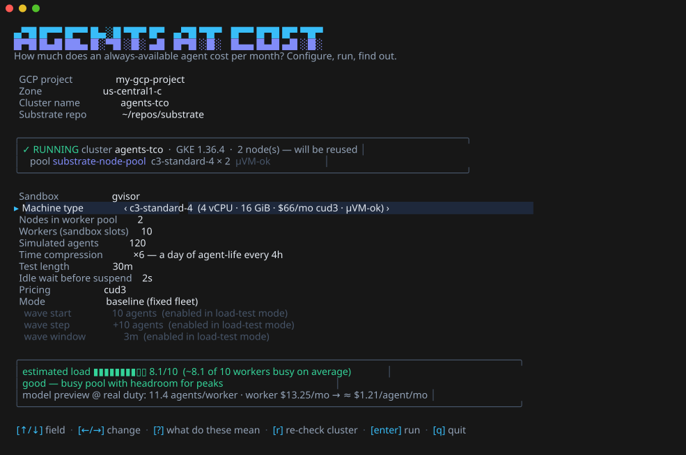

# substrate-agents-tco

Cost of running "personal agents" (OpenClaw / Hermes shaped: mostly idle,
always addressable) on GKE with [Agent Substrate](https://github.com/agent-substrate/substrate),
in two phases:

1. **Theory** — an interactive calculator for $/agent/month under
   suspend/resume multiplexing, for gVisor and microVM sandboxes.
2. **Practice** — a light auto-suspend service + Glutton-based fleet
   simulator that measures the density you actually get.

## Phase 1: the calculator

Open **`tool/index.html`** in a browser (no build, works from `file://`).
Every assumption is an input with its provenance next to it; outputs update
live: cost per agent per month (gVisor vs microVM side by side), achieved
oversubscription, cost breakdown, and sensitivity curves for the two key
variables — duty cycle and suspend+resume time.

The math is specified in [`docs/MODEL.md`](docs/MODEL.md). Core identity
(same equation as the benchmarking QPS formula, inverted):

```
occupancy/agent  d' = duty_cycle × (burst + idle_timeout + suspend + resume) / burst
agents/worker    N  = utilization / (d' × peak_to_average)
$/agent/month       = worker_$/hr × 730 / N  + snapshot GiB × $/GiB-mo + GCS ops + fixed/fleet
```

Defaults are sourced, not invented:
- **Workload** (~2.4% duty cycle): [`docs/RESEARCH-workloads.md`](docs/RESEARCH-workloads.md)
  — OpenClaw/Hermes footprints, heartbeat cadence, assistant usage stats,
  E2B/Fly/Modal price anchors.
- **Prices** (us-central1, retrieved 2026-09-25): [`docs/RESEARCH-gcp-pricing.md`](docs/RESEARCH-gcp-pricing.md)
  — per-family VM rates (OD/spot/CUD), nested-virt support matrix (microVM ⇒
  GKE Standard + Intel N1/N2/N4/C2/C3/C4 or N4D, ~10% CPU tax), GCS/PD rates.
- **Substrate mechanics**: [`docs/RESEARCH-substrate.md`](docs/RESEARCH-substrate.md)
  — snapshot sizes, GCS ops per cycle, per-sandbox overheads, 1 actor/worker.
- **Measured reality** (real OpenClaw actor on Substrate, and the source of
  the calculator's *default* suspend/resume/snapshot numbers):
  [`docs/RESEARCH-always-on-agent.md`](docs/RESEARCH-always-on-agent.md)
  — suspend 2.2s / resume 3.4s P50, 55–61 MiB snapshots, 0.72% measured duty
  on a 20-min cron, P99-peak fleet sizing, 47:1 bankable density. A "small
  test actor" preset (suspend 0.4s / resume 0.24s) shows the optimistic end.

The calculator also shows the plumbing behind the headline: each machine's
$/month, the fleet-wide monthly bill (machines + snapshots + storage ops +
cluster fee), cost per agent = bill ÷ agents, and the suspend/resume churn
rate (fleet resumes/min, cycles per worker per hour vs each worker's physical
ceiling) needed to make the multiplexing work.

Ballpark with defaults (10k agents, measured OpenClaw switch times, 10s idle
wait, 3yr CUD, both scenarios on the same n2-standard-16 so the comparison is
apples-to-apples): **≈$1.0/agent/month on gVisor** and **≈$1.1/agent/month on
microVM** — the residual gap is the nested-virt CPU tax plus slower switch
estimates. Repointing gVisor at non-nested families it alone can use (E2,
spot C3D) drops it to ~$0.7 or below. Versus ~$7–15/month for a dedicated
always-on worker or VPS. LLM tokens are out of scope (and typically dominate
— see the OpenClaw heartbeat-cost issue).

## Phase 2: measure it

One command runs the whole show — configure, build the cluster, run the real
workload, watch it live, end on the measured $/agent/month:

```bash
cd service && go run ./cmd/tco
```




A full-screen TUI (substrate-gke's visual language): config screen with
prefilled choices — GCP project (auto-detected), **gVisor vs microVM** (the
machine dropdown filters to nested-virt types for microVM, with live
prices), nodes/workers/fleet/compression/duration/pricing, **baseline or
load-test** mode — a feasibility check and model cost preview, then
self-skipping setup stages, a live view (awake/asleep agents, worker bar +
sparkline, suspend/resume latency, throughput, wedge warnings, load-test
wave table), and the cost card. Headless equivalent:
`service/experiment/run.sh` (`--load-test`, `--duration`, `--agents`, …).

Under the hood, three Go binaries built against the sibling `substrate`
checkout:

- **tco**: the TUI, driving the numbered scripts in `service/experiment/`.
- **autosuspender**: the missing suspend side of the loop (resume-on-request
  already exists in atenet). Activity-signal API + TTL fallback + occupancy
  sampling + a web dashboard at `/` + a **medic** that heals actors wedged
  by the resume-during-suspend platform bug (`docs/FINDINGS.md`).
- **agentsim**: N simulated personal agents against Glutton actors through
  the router — implicit resume, RAM working-set walk (demand paging), memory
  churn and file I/O every turn, Poisson sessions/wakes, time compression,
  and a wave-based load-test mode that finds the pool's ceiling.

Full instructions, knobs, "what you'll see" and gotchas:
[`service/README.md`](service/README.md). Design and experiment matrix:
[`docs/PHASE2-DESIGN.md`](docs/PHASE2-DESIGN.md).

## Measured result

First live run (2026-09-25, GKE, 50 agents on 10 workers / 2× c3-standard-4):
**$1.21/agent/month measured** — suspend 2.46s avg, resume 1.43s p50,
0.116 GiB snapshots, density 14.8:1 mean / 7.1:1 at p99 — matching the
calculator's prediction for the same config. Artifacts:
[`docs/runs/2026-09-25-baseline-x6/`](docs/runs/2026-09-25-baseline-x6/report.txt).
Surprises the harness caught along the way: [`docs/FINDINGS.md`](docs/FINDINGS.md)
(including a resume-during-suspend race that wedges actors and pins workers).

## Repo map

```
tool/index.html              interactive cost calculator (Phase 1)
docs/MODEL.md                the math behind it
docs/RESEARCH-*.md           sourced inputs: pricing, workloads, substrate, measured
docs/PHASE2-DESIGN.md        density experiment design
docs/FINDINGS.md             what the live runs surfaced (incl. the wedge bug)
docs/runs/                   archived artifacts of measured runs
service/cmd/tco              the TUI: configure → stages → live test → $$/agent card
service/cmd/autosuspender    suspend side of the loop + live web dashboard + medic
service/cmd/agentsim         personal-agent workload simulator (+ load-test waves)
service/experiment/          numbered scripts the TUI drives (also usable by hand)
service/analysis/            report.py (density deep-dive) · final_report.py ($$ card)
service/manifests/           k8s manifests for the experiment namespace
```
