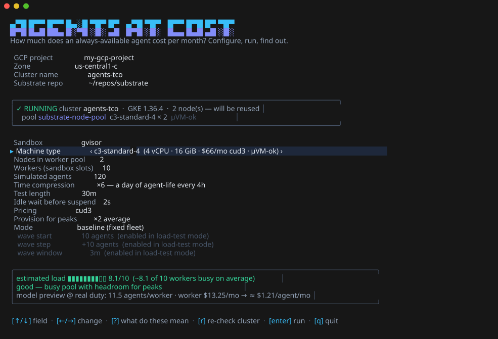
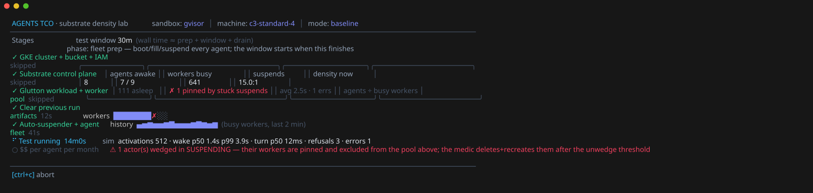
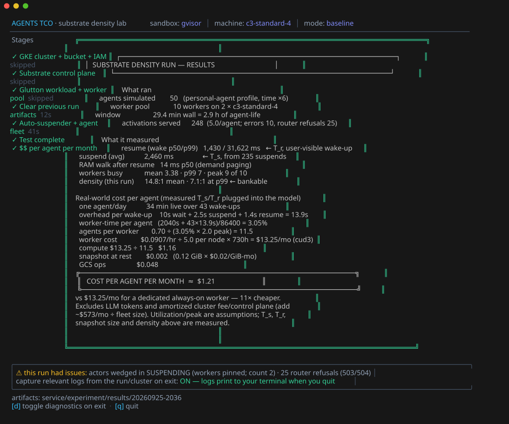

# Phase 2: auto-suspend service + density experiment

Three Go binaries that answer, empirically, "how much oversubscription do I
actually get, and what does an agent cost per month?" on a Substrate cluster
(`cmd/tco` is the front door; the other two run in-cluster):

- **`cmd/autosuspender`** — the missing piece of the suspend/resume loop.
  Substrate resumes actors on demand (atenet router) but nothing suspends
  them; this service does, from activity signals (`POST /touch|/begin|/end`)
  plus a TTL fallback. It also samples worker occupancy and serves a **live
  dashboard at `GET /`** (plus `/state.json`, `/occupancy.csv`,
  Prometheus-style `/metrics`). It is the workload-agnostic generalization of
  the gateway-embedded idle-suspender in the `always-on-agent` OpenClaw
  integration.
- **`cmd/agentsim`** — simulates N agents against **Glutton** actors
  through the router, in one of two workloads (see [Workloads](#workloads)):
  *personal agents* (OpenClaw/Hermes-shaped: ~3 sessions + ~40 short wakes
  per day, idle otherwise; each turn walks the RAM working set, dirties a
  rotating window of memory and writes/reads files) or the *coding-agent
  script* from Substrate's own benchmark suite (`--script coding-session`:
  20-step tasks with an LLM think gap before every step). Every activation
  resumes implicitly via HTTP. Time compression (`--compress`) plays a day
  in minutes. `internal/agentscript` is the script loader, vendored from
  substrate's `internal/benchmarking/boomer/agentsession`.

Analysis lives in `analysis/`: `final_report.py` renders the results card
ending in **measured cost per agent per month**; `report.py` is the density
deep-dive (mean/p99/peak busy workers — size on the peak).

## Prerequisites (once)

- `gcloud` authenticated, **with ADC**: `gcloud auth application-default login`
  (on corp-managed machines the CLI's own tokens are CBA-bound and GKE rejects
  them; the bootstrap detects this and switches kubectl to ADC automatically)
- `kubectl`, `envsubst`, Go, and `ko`: `go install github.com/google/ko@latest`
- the substrate repo checked out next door (default `~/repos/substrate`)
- a GCP project you can create clusters in

There is **no config file** — the TUI pre-fills everything (project detected
from gcloud) and you edit on screen; script users override via environment
variables (defaults in `experiment/lib.sh`).

## The TUI — one command, whole show

```bash
cd service && go run ./cmd/tco
```



A full-screen terminal app (same visual language as substrate-gke's
installer): a config screen with prefilled choices — machine type dropdown
with live prices, node count, **gVisor vs microVM** (list filtered to
nested-virt machines), fleet size, time compression, test length, idle wait,
pricing model, and **baseline vs load-test** mode — plus a live feasibility
check (predicted busy workers vs pool) and a model cost preview before you
commit. Then a stage rail (skipping whatever is already set up), the live
test view (awake/asleep agents, worker occupancy bar + sparkline, suspend
avg, wake p50/p99, throughput, wedge warnings, wave table in load-test
mode), and the finale: the measured **cost per agent per month** card.

Load-test mode activates agents in waves until refusals/errors cross
thresholds and reports the last sustainable level — the pool's real maximum
density for this workload.

On startup the TUI **probes GCP for the named cluster** and shows what's
really there — exists/not-found, GKE version, node count, and every node
pool with its machine type, size and nested-virt capability — pre-filling
the machine/node knobs from the discovered pool. Editing project/zone/
cluster re-probes automatically; `r` re-checks on demand. Machine types
found on the cluster but missing from the built-in catalog are added to the
dropdown (priced when the family is known).

Keys: `↑/↓` field, `←/→` change, type into text fields, `r` re-check
cluster, `enter` run, `q`/`ctrl+c` quit. Artifacts land in
`experiment/results/<timestamp>/` (run.log, occupancy.csv, metrics.txt,
report.txt, latency.csv — every latency as P50 / P90 / P99 / max with n —
and ui.log).





## Headless: `experiment/run.sh`

The same show without the full-screen UI — staged banners, a live ticker,
and the cost card at the end. Setup stages self-detect and skip what's
already in place.

```bash
cd service/experiment
./run.sh                                  # everything, with defaults
./run.sh --duration 10m --agents 30       # quicker test on existing infra
./run.sh --compress 12 --workers 20       # other knobs: see lib.sh
./run.sh --load-test                      # waves until failure -> max density
./run.sh --force                          # redo setup stages even if present
AGENTS=100 IDLE_TIMEOUT=5s ./run.sh       # env overrides work too
./run.sh --workload coding-session --think-scale 4   # the coding-agent script (below)
```

## Step-by-step: the numbered scripts

For debugging or partial reruns, each stage stands alone:

```bash
cd service/experiment
./10-bootstrap.sh               # GKE cluster + GCS bucket + IAM (~10-15 min)
./20-install-substrate.sh       # Substrate control plane (ko build + install)
./30-deploy-workloads.sh        # glutton ActorTemplates + WorkerPool ($WORKER_COUNT)
./40-deploy-experiment.sh       # our images (ko) + autosuspender + agentsim Job

# watch it live
kubectl -n agent-sim port-forward svc/autosuspender 8080 &
open http://localhost:8080/
kubectl -n agent-sim logs -f job/agentsim

./50-collect.sh                 # run.log + occupancy.csv + report -> results/<ts>/
./90-teardown.sh                # delete the cluster (add --bucket for the bucket)
```

Experiment knobs (environment overrides, defaults in `lib.sh`):
`SANDBOX_CLASS` (gvisor|microvm), `GVISOR_NODE_MACHINE_TYPE`, `NODE_COUNT`,
`WORKER_COUNT`, `AGENTS`, `COMPRESS`, `DURATION`, `IDLE_TIMEOUT`,
`PRICE_MODEL`, `PEAK_MODEL`/`PEAK_VALUE`, and for load-test
`LOAD_TEST`/`WAVE_START`/`WAVE_STEP`/`WAVE_INTERVAL` plus starvation gates
`--fail-wake-p99-ms`/`--fail-turn-p99-ms`. Every run reports the
not-starved evidence: wake/turn latencies, a fixed-work CPU probe, RAM-walk
paging time, and node PSI pressure. Re-run `40-deploy-experiment.sh` to launch a new Job with
changed knobs (it replaces the old one); `50-collect.sh` snapshots results
(density deep-dive + cost card) into a timestamped folder.

Feed the measured suspend/resume averages and achieved utilization back into
the calculator (`calculator.html` at the repo root) to reconcile theory
with practice.

## Workloads

`WORKLOAD` (TUI: the *Workload* field) picks what an awake agent does:

| `WORKLOAD` | What a session is | Knobs |
|---|---|---|
| `personal` | an 8-min chat (ping every 30 s, RAM churn + file write per turn); plus `WAKES_PER_DAY` 15-s check-ins — the profile the 2026-09-25 $1.21 baseline used | `SESSIONS_PER_DAY`=3, `WAKES_PER_DAY`=40, `MEM_TARGET`, `MEM_CHURN` |
| `coding-session` (**default**) | one **task** of the agent-session script from substrate's benchmarking suite ([#1934](https://github.com/agent-substrate/substrate/pull/1934), [#2046](https://github.com/agent-substrate/substrate/pull/2046)): 20 steps — read the task, clone, explore, install deps, build, run tests, reason about the failure, fix, rebuild, write tests, lint, refactor, package, commit — each costing the sandbox the CPU (`burn_cpu`), network (`ingest`), disk and RAM the real action would, with an LLM **think gap** before every step | `SESSIONS_PER_DAY`=8 (tasks/day), `WAKES_PER_DAY`=0, `THINK_SCALE`=4, `SCRIPT_SUSPEND`=driver, `ACTOR_MEMORY`=1Gi |
| `ping` | the **one-ping GluttonUser loop** of substrate's benchmarking suite (what the Sep 2026 Prow 200K run drives): a virtual user owns `PING_ACTORS_PER_USER` actors and serves them one at a time — wake by ping (implicit resume), stay awake `PING_LIVE`, SuspendActor, sleep `PING_WAIT`, next actor. No memory fill ("nomem"), no other work, so a wake is the bare restore of an idle sandbox and overcommit is N:1 **by construction**. Measures switch cost and control-plane behavior under churn, not agent work | `PING_ACTORS_PER_USER`=20, `PING_WAIT`=10s, `PING_LIVE`=0s, `ACTOR_MEMORY`=256Mi; size the fleet as `AGENTS` = users × 20 with one user per worker |
| `path/to/script.yaml` | your own script in the same YAML format (op table in substrate's `benchmarking/README.md`, "Writing an agent-session script"); validated locally, shipped to the Job as a ConfigMap | same as above |

How a step runs (`cmd/agentsim/script.go`): sleep the think gap (script
value × `THINK_SCALE`, ±20 % jitter — **not** time-compressed, like
suspend/resume it is the quantity under test), check the actor's state,
send the wake ping through the router (`first_req_ms`, the user-visible
resume when `was_suspended=1`), run the step's ops (`step_ms`), then either
call SuspendActor at once (`SCRIPT_SUSPEND=driver`, the upstream
benchmark's behavior; `suspend_ms`) or leave it to the autosuspender's
`IDLE_TIMEOUT` (`idle`, production-like: gaps shorter than the wait keep
the worker). `--compress` still governs the Poisson gaps between tasks.
The summary prints a per-step table (`=== agentsim steps ===`) and the
cost card prices the task shape it finds in the log's profile block:

```
worker-time per agent = (tasks × steps × step_work + gaps spent awake + wakes × (wait + T_s + T_r)) / 86400
```

Why the defaults: the script's own think gaps are 2–8 s — a fast model —
which is shorter than a suspend+resume on this pool, so at ×1 the worker is
never free and density is ~1. ×4 (8–32 s gaps) is closer to a coding model;
×10 approaches the "80–95 % idle" coding-agent class. The script needs 1 GiB
actors (~96 MiB of arrays + ~110 MiB of tmpfs files, guest peak ~320 MiB);
agentsim refuses a smaller template, and `lib.sh` sets `ACTOR_MEMORY=1Gi`
when a script is selected. Expect snapshots of a few hundred MiB and
multi-second resumes (see the 512 MiB results in `research/research.md`)
and far more suspend/resume churn per agent-day than the personal profile:
restore CPU, not time-sharing, is what this workload saturates first.

Check a script without a cluster:

```bash
go run ./cmd/agentsim --check-script coding-session        # or a path
```

## What you'll see

**1. The live dashboard** (`http://localhost:8080/` after the port-forward,
refreshes every 2 s). Five tiles — agents, awake right now, busy workers /
pool, density now, suspends (rate + avg latency + errors) — and a chart of
**workers busy vs actors awake** with the pool size as a dashed line. A
healthy run looks like a **sawtooth**: orange/blue spikes as agents wake and
hold workers, falling back as the autosuspender puts them to sleep, with
almost all actors sitting in `suspended`. Two failure signatures to know:

- blue pinned at the dashed pool line → pool saturated; new wake-ups are
  parking (≤5 s) and then getting 503s (they show up as `refusals` in the
  agentsim summary);
- a red "⚠ N actor(s) wedged in SUSPENDING" line → the resume-during-suspend
  race (agent-substrate/substrate#1914): the suspend never commits and the worker
  stays pinned. The autosuspender's **medic** (`--unwedge-after`, default 3m)
  heals these automatically — delete + recreate from the template — and
  counts interventions in `autosuspend_unwedged_total`. If wedges keep
  climbing faster than the medic clears them, also check bucket IAM
  (ate-api-server missing `storage.objects.list` causes the same signature).

The "Density over the window" table gives mean/p50/p99/peak busy workers and
the corresponding density — **the p99/peak line is the number to bank**.

**2. autosuspender logs** (`kubectl -n agent-sim logs deploy/autosuspender`) —
one JSON line per suspend:

```json
{"msg":"autosuspender up","listen":":8080","atespace":"agents-sim","idle_timeout":"10s",...}
{"msg":"suspended","actor":"sim-0007","elapsed_ms":2214,"forced":false}
```

`elapsed_ms` here is your measured suspend time (`T_s`) for the calculator.

**3. agentsim logs** — setup progress, then a warning only when something is
off, then the final summary + embedded CSV:

```
=== agentsim summary ===
agents=50 activations=1291 pings=3410 errors=2 refusals_503_504=7 compress=60
session  n=94    first-request ms p50=142 p90=4180 p99=5327 max=6180
wake     n=1197  first-request ms p50=3891 p90=4412 p99=5721 max=9822
post-resume RAM walk ms p50=310 p99=1450 (demand-paging cost)
```

Read it like this: `wake` p50 ≈ resume time + routing (the actor was asleep);
`session` p50 is bimodal — small if a heartbeat recently woke the actor,
resume-sized otherwise. The RAM-walk line is the demand-paging tail that a
plain ping never shows. `refusals` should be ~0; if not, the pool is too
small for the duty cycle you configured.

**4. The report** (`analysis/report.py`) turns both files into the density
verdict:

```
== density ==
effective per-agent worker occupancy (compressed): 6.10%
achieved density  (mean):   16.4 : 1   <- workload idleness, not bankable
achieved density  (p99):     7.1 : 1   <- size the pool on this
...
compute cost/agent-month = $1.02 (+ snapshot storage + ops; ...)
```

(Numbers above are illustrative — the point is the shape. At `--compress 60`
the switching tax is 60× overweighted, so real-world density is much higher;
extrapolate with the calculator.)

**5. Cross-checks without the dashboard**: `kubectl ate get actors -a
agents-sim` (states flipping RUNNING↔SUSPENDED), `kubectl ate get workers`,
or always-on-agent's `demo/watch-fleet.py` pointed at the `agents-sim`
atespace.

## Gotchas (learned from always-on-agent and our own runs)

- **Resume-during-suspend wedge** (found here; filed as agent-substrate/substrate#1914): a request
  arriving while an actor is suspending can leave it in SUSPENDING forever,
  worker pinned; a few of these collapse a small pool. The medic works
  around it; the bug itself belongs upstream.
- **Cross-version residue on reused nodes/clusters**: after installing a
  different substrate version on the same cluster, nodes keep the old
  `ate.dev/substrate-version` label (new atelet DaemonSet sits at desired 0
  → no credential-broker socket → workers never report capacity → every
  placement fails "no free workers available" with a FREE pool). The
  install stage now detects and relabels automatically; for a truly clean
  slate, recreate the node pool (hostPath state also survives pod wipes).
- **Keep-alives wedge checkpoints**: if you point your own client at actors,
  disable HTTP keep-alives — an idle connection held open into the sandbox
  makes the next gVisor checkpoint fragile (agentsim does this already).

- **Pre-warm every worker node**: the first resume on a cold node is far
  slower and can 504 permanently on some builds. `agentsim`'s setup phase
  (boot + RAM fill for every actor) doubles as a pre-warm, but let it finish
  before treating latencies as data.
- **Router budgets**: atenet parks a resume-triggering request for max 5s
  (`--parked-request-budget`) inside a 10s route timeout (`--route-timeout`).
  Real agent resumes (3.4s P50 for OpenClaw) leave little headroom — raise
  both on the atenet deployment for large-snapshot experiments. agentsim
  retries 503/504 with backoff and reports them separately (`refusals`).
- **Pool full = 503, not a queue** (past the park budget). One actor per
  worker is the concurrency unit until multi-actor workers land.
- **Bucket IAM**: both `atelet` *and* `ate-api-server` need
  `roles/storage.objectAdmin` on the snapshot bucket; missing the second
  makes the *second* suspend fail and wedges the actor in SUSPENDING.
- **Suspend delay = idle-timeout + up to one poll interval.** Keep
  `--poll` well under `--idle-timeout`.
- **Script driver mode and the autosuspender both suspend.** With
  `SCRIPT_SUSPEND=driver` agentsim calls SuspendActor right after each
  step; the autosuspender may race it once the idle wait passes. Both
  tolerate the conflict (Aborted/FailedPrecondition), and the report takes
  `T_s` from agentsim's `suspend_ms` in that mode. The medic still matters:
  a 1 GiB actor checkpoints slowly, so keep `UNWEDGE_AFTER` above the
  slowest honest suspend.
- **Compressed time**: `--compress k` divides workload intervals by k but
  suspend/resume/idle-timeout run in real time, so the switching tax is k×
  overweighted vs reality. Compare measurements against the model run at the
  *compressed* duty cycle; extrapolate to real duty with the calculator.

## Local build check

```bash
cd service && go build ./... && go vet ./...
```
